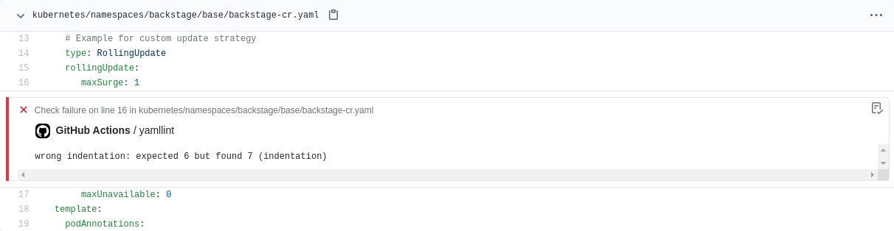

# Lint All Your YAML Files

Using this GitHub Action in your workflow to lint all yaml files and then annotates every finding in the changed files view.



## Usage

Create a new workflow with the following content:

```yaml
name: YAMLlint

on:
  push:
    branches:
      - '**'
    tags-ignore:
      - '**'

jobs:
  yamllint:
    runs-on: ubuntu-latest
    steps:
      - name: Checkout
        uses: actions/checkout@v2

      - name: Lint and Annotate
        uses: staffbase/yamllint-action@v1
        with:
          token: ${{ secrets.GITHUB_TOKEN }}
          ## The target path is processed recursively
          target-path: <relative-folder-path>
          ## The action name is only necessary if the current action name changed
          action-name: <name-of-the-action>
```

## Credits

This action is using

- [adrienverge/yamllint](https://github.com/adrienverge/yamllint)
- [sdesbure/docker_yamllint](https://github.com/sdesbure/docker_yamllint)


<table>
  <tr>
    <td>
      
    </td>
    <td>
      <b>Staffbase GmbH</b>
      <br />Staffbase is an internal communications platform built to revolutionize the way you work and unite your company. Staffbase is hiring: <a href="https://jobs.staffbase.com" target="_blank" rel="noreferrer">jobs.staffbase.com</a>
      <br /><a href="https://github.com/Staffbase" target="_blank" rel="noreferrer">GitHub</a> | <a href="https://staffbase.com/" target="_blank" rel="noreferrer">Website</a> | <a href="https://jobs.staffbase.com" target="_blank" rel="noreferrer">Jobs</a>
    </td>
  </tr>
</table>
